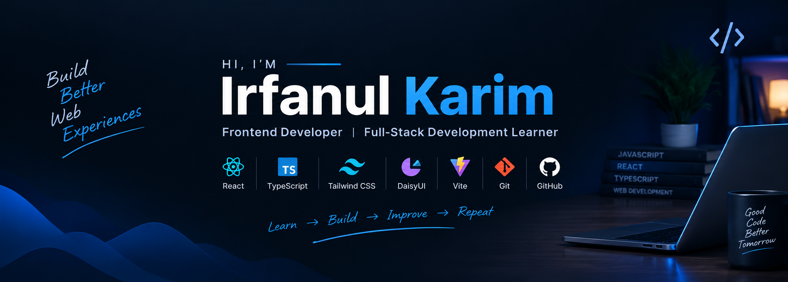

<div align="center">

<!-- HEADER -->



<!-- TYPING ANIMATION -->

<a href="https://github.com/Irfan916">


</a>

<br/>

<!-- SOCIAL BUTTONS -->

<a href="https://github.com/Irfan916">

</a>


</div>

---

# 👋 Hey, I'm Irfan!

## 🧑‍💻 About Me

I'm a developer from **Bangladesh** who enjoys building modern, responsive, and interactive web applications.

I'm currently focused on improving my **frontend development skills** while gradually moving toward **full-stack development**.

I enjoy learning new technologies, building real-world projects, solving problems, and turning ideas into functional web experiences.

🌱 Currently learning React, TypeScript & modern web development
💻 Building responsive and interactive web applications
🎨 Interested in UI/UX and clean interface design
🧩 Enjoy working with reusable components
🚀 Building projects to improve my development skills
🤖 Interested in AI/ML and modern technologies
📚 Always learning and experimenting with new technologies

# ⚡ Tech Stack

## 🎨 Frontend

<div align="left">


</div>

## 🛠️ Tools

<div align="left">


</div>

## 🌱 Exploring

<div align="left">


</div>

---


# 🔥 Contribution Streak

<div align="center">


</div>

---


# 🎯 What I'm Working On

```text
┌──────────────────────────────────────────────┐
│                                              │
│   ⚛️  React Development                     │
│                                              │
│   🔷 TypeScript                              │
│                                              │
│   🎨  Responsive UI                          │
│                                              │
│   🧩  Reusable Components                    │
│                                              │
│   ⚡  Modern Frontend Development            │
│                                              │
│   🌐  Full-Stack Development                 │
│                                              │
│   🚀  Real-World Projects                    │
│                                              │
└──────────────────────────────────────────────┘
```

---

# 🧠 My Development Journey

I'm continuously improving by building projects instead of only learning theory.

**Learn → Build → Break → Debug → Improve → Repeat**

---

# 💡 Developer Philosophy

> ### "The best way to learn development is to build."

I believe every project teaches something new.

Sometimes it's a new technology.

Sometimes it's a difficult bug.

Sometimes it's simply learning how to write better code.

Either way, **keep building. 🚀**

---

# 🤝 Let's Connect

<div align="center">

<a href="https://github.com/Irfan916">


</a>

</div>

---

<div align="center">

### 💙 Thanks for visiting my profile!

**Keep Learning • Keep Building • Keep Improving**

<br/>


</div>
